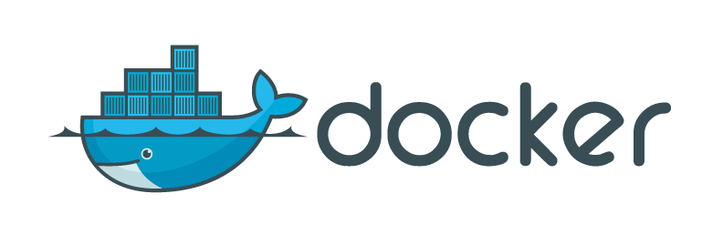

빠르게 도커를 익혀 사용해야할 일이 생겨 도커에 대한 전반적인 지식과 핵심 개념을 정리해보았습니다.

## 도커의 필요성

새로운 서버를 세팅하거나 개발환경을 설정하는 일은 매우 복잡하고 많은 노력과 시간을 요구합니다. 하나의 서버안에서 여러 프로그램을 돌려야하는 경우 언어 버전이 다르게되면 까다로운 설치과정을 거쳐야합니다. 시간이 흐르며 서버의 환경이 지속적으로 바뀌는 데 이럴때 마다 서버 세팅을 바꾸는 것은 매우 비효율적인 일이 될 것입니다. 이러한 문제를 해결하기 위해 도커를 사용합니다.

## What is Docker?

위키백과에서 설명하는 도커를 인용하면 "도커는 리눅스의 응용 프로그램들을 프로세스 격리 기술들을 사용해 컨테이너로 실행하고 관리하는 오픈 소스 프로젝트" 입니다. 쉽게 말해 **프로그램의 운영 환경을 컨테이너라는 것에 담아서 통째로 옮길수 있도록 도와주는 소프트웨어**입니다. 한번 세팅한 환경을 다른 컴퓨터나 서버로 쉽게 이동, 복사하여 사용할 수 있으므로 서버의 개수를 늘려야하거나 다른 사람과 동일한 환경을 세팅하여 프로그램을 개발할때 매우 유용하게 사용될 수 있습니다.

도커에 대해 이해하려면 컨테이너와 이미지라는 두가지 핵심 개념에 대해 알아야 합니다. 지금부터는 두 개념이 무엇인지에 대해 알아보겠습니다.

## Container

컨테이너는 독립된 공간에서 프로세스가 작동하게 하는 기술로 일종의 가상화 기술입니다. 화물선에 실리는 컨테이너 박스안에 화물들이 담기는 것 처럼 컨테이너 안에 프로그램 실행환경을 넣어서 옮기게 됩니다.

그렇다면 기존의 가상화 방식인 가상머신과 컨테이너의 차이는 무엇일까요?

### Container와 Virtual Machine의 차이점

VirtualBox와 같은 기존의 가상머신은 호스트 OS위에 게스트 OS전체를 가상화하여 사용하기 때문에 무겁고 느립니다. 때문에 실제 운영환경에서는 가상머신으로 서버를 돌릴 수 없습니다. 이와 다르게 Container는 도커 상에서 프로세스를 격리하는 방식으로 사용됩니다. 게스트 OS가 없기 때문에 훨씬 가볍고 빠릅니다.하나의 서버에는 다수의 컨테이너를 생성하여 사용할 수 있습니다. 각각의 컨테이너는 독립적인 공간이라서 서로에게 영향을 주지 않습니다.

## Image

이미지는 컨테이너 생성에 필요한 파일과 설정값등을 포함하고 있는 read-only 객체를 말합니다. 이미지는 read-only라서 값이 변하지 않습니다. 하나의 이미지로 여러 컨테이너를 생성할 수도 있습니다. 앞서 말했듯 이미지는 변경이 일어나지 않기 때문에 컨테이너의 상태 변경은 이미지에 영향을 미치지 않습니다. 서버를 늘려야하는 경우 새 서버에 미리 만들어놓은 이미지를 받아 컨테이너를 생성하기만 하면 됩니다.

### Image Layer

도커 이미지를 레이어 형태로 만들어 효율적으로 관리합니다. 이미지는 컨테이너 실행을 위한 많은 정보를 가지고 있기 때문에 보통 용량이 수백메가MB에 이릅니다. 기존 이미지에 새로운 내용을 조금 추가한 새로운 이미지를 받기 위해 전체를 다시 다운받는다면 매우 비효율적이게 됩니다.

도커는 이런 문제를 해결하기 위해 레이어layer라는 개념을 사용하고 유니온 파일 시스템을 이용하여 여러개의 레이어를 하나의 파일시스템으로 사용할 수 있게 해줍니다. 하나의 이미지는 여러개의 레이어로 구성되고 파일이 추가되거나 수정되면 새로운 레이어가 생성됩니다.

- ubuntu 이미지가 A + B + C의 집합이라면,
- ubuntu 이미지를 베이스로 만든 nginx 이미지는 A + B + C + nginx가 됩니다.
- nginx 이미지 기반으로 만든 webapp 이미지는 A + B + C + nginx + source 레이어로 구성됩니다.
- webapp 소스를 수정하면 A, B, C, nginx 레이어를 제외한 새로운 source 레이어만 다운받아 효율적으로 이미지를 관리할 수 있습니다.
