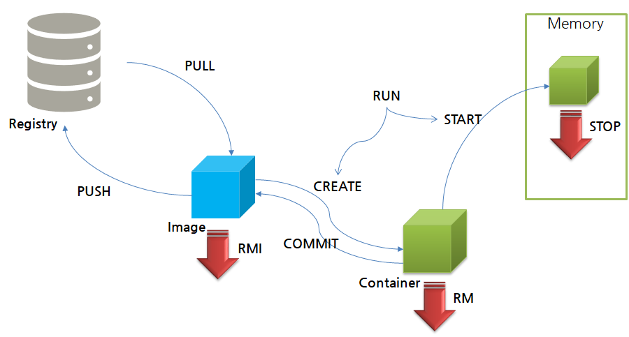

```
docker run -d -p 8080:8080 --name tc consol/tomcat-7.0
```

- -d: background로 실행
- -p: 포트 포워딩이라고 하며 컨테이너와 로컬의 포트연결 local port:container port
- --name:생성할 컨테이너 명
- 맨 마지막이 이미지 이름

## Docker Life Cycle



- RUN 사용시 이미 컨테이너가 존재하더라도 컨테이너를 새로 생성하여 START하므로 주의!
- COMMIT 사용시 컨테이너에 포함된 파일들을 이미지화 해 줌

### 1. 이미지 다운로드와 삭제

```docker
docker pull mysql
docker rmi mysql
```

### 2. 컨테이너 생성

```docker
docker run -d --name tc mysql
```

### 3. 실행중인 컨테이너 확인

```docker
docker ps #컨테이너 확인(실행이 중지된 컨테이너는 보이지 않음)
docker ps 0a # 모든 컨테이너 확인
```

### 4. 컨테이너 중지

```docker
docker stop 컨테이너 ID
```

### 5. 컨테이너 삭제

```docker
docker rm 컨테이너 ID # 중지된 상태에서만 삭제 가능
```

### 6.이미지 삭제

```docker
docker rm mysql
docker rm -f mysql #컨테이너는 사용중인데 이미지만 삭제할 때
```
